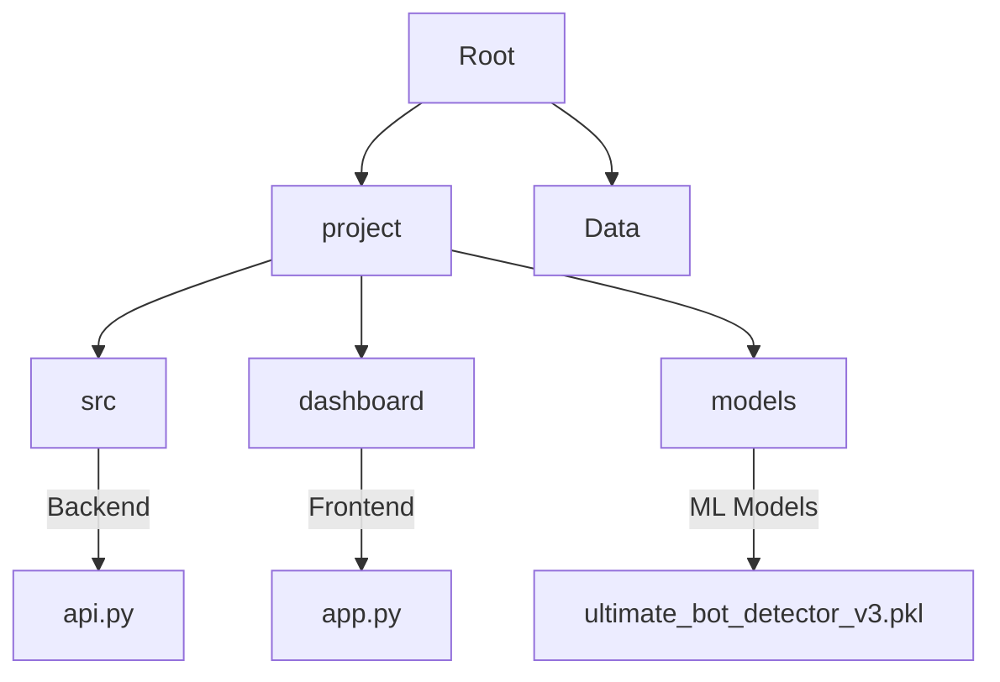

# 🤖 ULTIMATE Bot Detection System

<div align="center">


> *Identifying the synthetic from the organic in the digital age.*

[](https://streamlit.io/)
[](https://fastapi.tiangolo.com/)
[](https://www.python.org/)
[](https://xgboost.readthedocs.io/)

[Features](#-key-features) • [Installation](#-quick-start) • [Architecture](#-system-architecture) • [Usage](#-how-to-use)

</div>

---

## 🌌 Overview

**ULTIMATE Bot Detection** is a state-of-the-art machine learning system designed to analyze Twitter (X) profiles and determine with high precision whether an account is human or a bot. Powered by an ensemble of advanced algorithms including **XGBoost**, **CatBoost**, and **LightGBM**, it digs deep into behavioral patterns, network anomalies, and profile metadata.

## ⚡ Key Features

*   **🕵️ Real-time Analysis**: Instant classification of any public Twitter profile.
*   **🧠 Ensemble Intelligence**: Combines multiple ML models for superior accuracy.
*   **📊 Comprehensive Dashboard**: Visual metrics, probability gauges, and radar charts.
*   **🔍 Batch Processing**: Analyze lists of users simultaneously.
*   **🌗 Adaptive UI**: Stunning Futuristic Dark/Light mode interface.
*   **🛡️ Bot Risk Scoring**: Detailed factors explaining *why* an account is suspicious.

---

## 📂 Project Structure

We use the **`project`** folder as the core of this application.



*   **`project/`**: The main codebase.
    *   **`src/`**: Contains the FastAPI backend and core logic.
    *   **`dashboard/`**: Contains the Streamlit frontend application.
    *   **`models/`**: Stores the pre-trained machine learning models.
*   **`Data/`**: Raw datasets used for training (not needed for running the app).

---

## 🚀 Quick Start

Follow these steps to launch the system:

### 1. Prerequisites
Ensure you have **Python 3.9+** installed.

### 2. Activate Virtual Environment
The project includes a pre-configured virtual environment. Open your terminal in the root directory:

**Windows (CMD/PowerShell):**
```bash
project\src\bot_detection_venv\Scripts\activate
```

### 3. Install Dependencies (If needed)
Once the environment is activated:
```bash
pip install -r requirements.txt
```

### 4. Run the System
You need to run **two** terminals. **Activate the virtual environment in BOTH terminals first.**

**Terminal 1: Start the Backend API**
```bash
cd project/src
python api.py
```
> The API will start at `http://localhost:8000`

**Terminal 2: Start the Dashboard**
```bash
streamlit run project/dashboard/app.py
```
> The Dashboard will open automatically in your browser at `http://localhost:8501`

---

## 🎮 How to Use

1.  **Launch the Dashboard** as described above.
2.  Navigate to **"🔮 Single Analysis"**.
3.  Enter a Twitter **Username** (or manually input profile stats).
4.  Click **"Analyze Account"**.
5.  Watch as the system dissects the profile and renders a verdict: **🤖 BOT** or **👤 HUMAN**.

---

<div align="center">
    <i>Built for the future of digital authenticity.</i>
</div>
